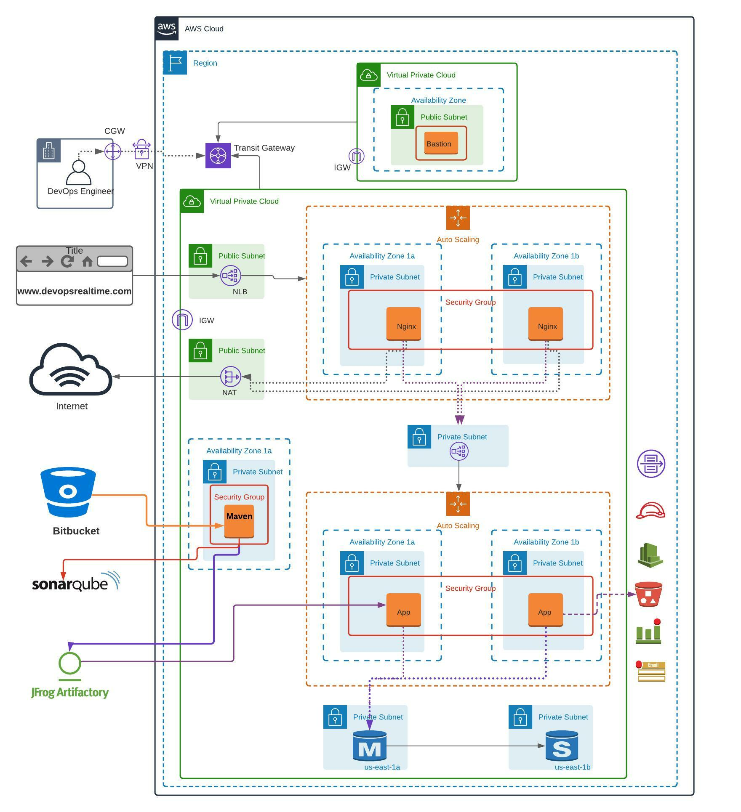

# Project Overview

This project aims to deploy a scalable, highly available, and secure Java application using a 3-tier Amazon Web Services (AWS) architecture. The architecture includes a Virtual Private Cloud (VPC) setup with separate networks for a Bastion Host, application servers, and essential components like Nginx, Tomcat, and a MySQL database.

## Architecture Highlights

- **VPC Setup:** Establishes a robust network structure, including public and private subnets, to ensure security and efficient communication.
  
- **Bastion Host:** Facilitates secure access to the private network for administration purposes.

- **Maven Build:** Implements a continuous integration and continuous deployment (CI/CD) pipeline using Maven, Bitbucket, Sonarcloud, and Jfrog for efficient code management and deployment.

- **3-Tier Architecture:** Deploys a MySQL RDS database as the backend, a Tomcat application server as the middleware, and Nginx as the frontend, all orchestrated in a highly available and auto-scalable setup.

- **Post-Deployment Actions:** Configures cron jobs, Cloudwatch alarms, and other post-deployment tasks to ensure optimal system performance and monitoring.

## Purpose

The primary goal of this project is to showcase best practices in deploying and managing a Java application in a cloud environment. It demonstrates the use of various AWS services, automation tools, and CI/CD practices to achieve a secure, scalable, and highly available architecture. Developers and cloud enthusiasts can leverage this project to understand and implement similar setups for their applications.

](https://devopsrealtime.com/deploy-java-application-on-aws-3-tier-architecture/)

Sample Java Login application uses "UserDB" database and Table schema to store the Employee Login details.

How to see a list of Databases
SHOW DATABASES;
How to Create a Database
CREATE DATABASE UserDB;
How to List Tables
USE UserDB;
SHOW TABLES;
How to Create Table
Below is a Query to create the required TABLE schema to store Employee records
CREATE TABLE Employee (
  id int unsigned auto_increment not null,
  first_name varchar(250),
  last_name varchar(250),
  email varchar(250),
  username varchar(250),
  password varchar(250),
  Redgate timestamp,
  primary key (id)
);

List Table data
SELECT * FROM Employee;

Describe Table schema
DESCRIBE Employee;
